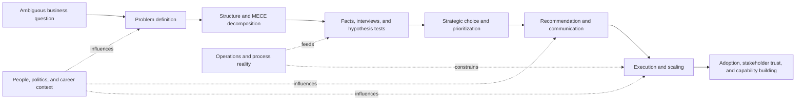

# Consulting Method Knowledge Graph

This map shows how the child skills fit together. Use it to choose the smallest set of frameworks that cover the user's problem.

## Core Flow

## Domain Clusters

### 1. Problem Framing And Structure

Purpose: turn fuzzy questions into a rigorous workplan.

Primary skills:
- `mckinsey-problem-solving-methodology`
- `mckinsey-problem-solving-methodology-2`
- `structured-problem-solving-mckinsey`
- `mckinsey-issue-tree-structuring`
- `mece-compliance-validation`
- `key-driver-analysis`
- `mckinsey-problem-solving-strategies`
- `client-concept-application`

Typical sequence: define the problem, build an issue tree, validate MECE, identify the key drivers, then decide whether to reframe.

### 2. Research, Evidence, And Insight Creation

Purpose: replace opinion with facts while avoiding data traps.

Primary skills:
- `mckinsey-research-methodology`
- `fact-based-research-mckinsey`
- `hypothesis-driven-data-analysis`
- `fact-creation-methodologies`
- `interview-techniques`
- `expert-interviewing-mckinsey`
- `mckinsey-interview-techniques`
- `daily-knowledge-synthesis`
- `difficult-stakeholder-management`

Typical sequence: define hypotheses, gather existing facts, interview experts, create new facts when data is missing, synthesize daily.

### 3. Strategy And Market Positioning

Purpose: choose where to play and how to win.

Primary skills:
- `3c-analysis-overlap-dynamics`
- `external-forces-analysis`
- `dynamic-strategic-positioning`
- `creating-shared-value`
- `esg-stakeholder-management`
- `consulting-firm-methodology-selection`

Typical sequence: map customer/company/competitor overlap, test external forces, choose strategic position, incorporate stakeholder and ESG constraints where relevant.

### 4. Decision And Prioritization

Purpose: choose the few moves that matter.

Primary skills:
- `impact-speed-prioritization-matrix`
- `pareto-analysis-resource-optimization`
- `matrix-quadrant-decision-strategy`
- `work-prioritization`
- `project-feasibility-assessment`
- `solution-feasibility-assessment`

Typical sequence: list options, score impact and speed, isolate the vital few, test feasibility, assign ownership or delegation.

### 5. Communication, Proposals, And Executive Influence

Purpose: make recommendations accepted and acted on.

Primary skills:
- `consulting-proposal-structures`
- `mckinsey-communication-principles`
- `effective-presentation-communication`
- `effective-presentation-communication-2`
- `executive-communication-integrity`
- `presentation-24-hour-cutoff-rule`
- `waterfall-chart-visualization`
- `hierarchical-face-exchange`

Typical sequence: choose conclusion-first or story-first narrative, build evidence-backed slides, finalize early, plan who delivers which message.

### 6. Execution, Scaling, And Change

Purpose: turn approved recommendations into institutional results.

Primary skills:
- `mckinsey-project-lifecycle`
- `project-execution-management`
- `change-management-implementation`
- `implementation-scaling-motivation-strategy`
- `exponential-growth-model-0-to-100`
- `consulting-client-engagement`
- `process-standardization-for-leverage`

Typical sequence: define phases, secure client ownership, plan implementation governance, standardize repeatable work, scale from pilot to organization.

### 7. Operations And Production

Purpose: diagnose process, factory, and delivery problems.

Primary skills:
- `qcd-issue-tree-production-analysis`
- `toyota-stop-valve-protocol`
- `process-standardization-for-leverage`
- `matrix-quadrant-decision-strategy`

Typical sequence: stop defects when urgent, decompose by quality/cost/delivery, identify root cause, standardize before delegating or automating.

### 8. Team, Facilitation, And Collaboration

Purpose: mobilize people to solve hard problems together.

Primary skills:
- `team-facilitation-mckinsey`
- `team-management-and-mobilization`
- `team-cohesion-management`
- `mckinsey-team-management`
- `brainstorming-workflow`
- `brainstorming-process`
- `brainstorming-facilitation`
- `pre-brainstorming-preparation`
- `motivation-flow-state-management`
- `left-right-brain-connectivity`

Typical sequence: prepare hypotheses before the session, facilitate structured divergence, synthesize outputs, assign action owners, manage team energy.

### 9. Client, Stakeholder, And Business Development

Purpose: build trust, surface hidden resistance, and create demand.

Primary skills:
- `consulting-client-engagement`
- `non-promotional-business-development`
- `non-selling-client-development`
- `difficult-stakeholder-management`
- `esg-stakeholder-management`
- `creating-shared-value`
- `client-concept-application`

Typical sequence: define the real client, map stakeholders, build non-sales trust, handle resistance, align project with value for the organization and broader stakeholders.

### 10. Professional Development And Corporate Navigation

Purpose: help the user operate effectively in high-pressure professional environments.

Primary skills:
- `mckinsey-professional-principles`
- `mckinsey-organization-dynamics`
- `active-mentor-finding-management`
- `mckinsey-formal-mentorship-reality`
- `career-expectation-management`
- `mckinsey-four-washes-transformation`
- `mckinsey-talent-assessment`
- `mckinsey-case-interview-strategy`
- `boundary-testing-in-egalitarian-organizations`
- `mckinsey-confidentiality-protocol`
- `work-life-boundary-management`
- `business-travel-survival`
- `mckinsey-business-travel-packing-checklist`
- `administrative-support-management`
- `book-acknowledgement-reference`
- `mckinsey-methodology-reading-guide`

Typical sequence: clarify the professional situation, diagnose power and expectations, choose mentor/support moves, protect trust and boundaries.

## Combination Logic

Use multiple skills when the user asks for an end-to-end answer:

- Strategy case: framing + research + strategy + prioritization + communication.
- Transformation: framing + stakeholder engagement + execution + change management.
- Operations crisis: Toyota stop valve + QCD issue tree + root-cause evidence + implementation governance.
- Executive memo: problem solving + prioritization + consulting proposal structure + communication principles.
- Career navigation: organization dynamics + mentor management + expectation management + professional principles.
